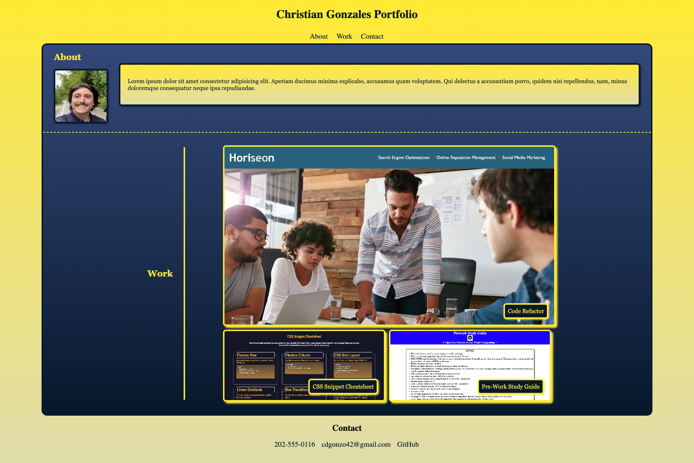

# professional-portfolio

## Description

This my portfolio of the work I have done so far in this bootcamp. It showcases the work that I have done and my progress.

The purpose of this webpage was to not only provide links to the webpages I have built but also to showcase the new skills I have learned including new CSS skills with flex-box and hover states. I have also provided links in the contact section for email, GitHub profile, and a phone number. Another big emphasis for this project was the page layout, it had to be easy for the viewers to move around and see my featured project as well as the two others.

At the completion of this project I have a much better understanding of flexbox. I learned how parent-child relationships play out when starting from scratch, that planning ahead and wire framing are extremely important. I also became more familiar with media queries and the challenges of various media formats.

## Resources

[Deployed Site](https://cdgonzo23.github.io/professional-portfolio/)

[Repository](https://github.com/cdgonzo23/professional-portfolio)

### ScreenShots
